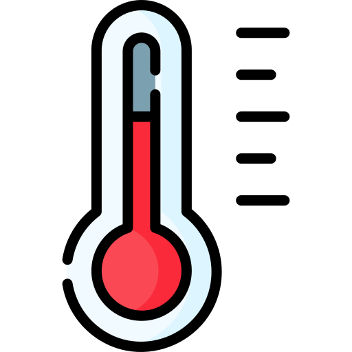

# <h1 align='center'> Daily Weather Report </h1>
<h3 align='center'>🕒 Indonesian Time(UTC+9.00): <u>2023-12-30 03:43:01 WIB</u> (🤖Automated)</h3>

<table align='center'>
<tr>
<td align='center'><b>Tokyo</b>  <b>6.40°C</b>  <b>Clouds</b> <b>(few clouds)</b> <b>Feels Like: 3.26°C</b></td>
</tr>
<td>
<table>
<tr>
<td align='center'> Minimum Temperature: <b>3.36°C</b></td>
<td align='center'> Maximum Temperature: <b>8.68°C</b></td>
</tr>
<tr>
<td align='center'> Humidity: <b>62%</b></td>
<td align='center'> Atmospheric Pressure: <b>1020 hPa</b></td>
</tr>
<tr>
<td align='center'> Wind Speed: <b>4.63 m/s</b></td>
<td align='center'> Wind Direction: <b>30°</b></td>
</tr>
<tr>
<td align='center'> Wind Gust Speed: <b>N/A m/s</b></td>
<td align='center'> Cloudiness: <b>20%</b></td>
</tr>
<tr>
<td align='center'> Visibility: <b>10000 meters</b></td>
<td align='center'> Sunrise: <b>2023-12-30 04:50:19</b></td>
</tr>
<tr>
<td colspan='2' align='center'> Sunset: <b>2023-12-30 14:36:07</b></td>
</tr>
<tr>
<td colspan='2' align='center'><b>Coordinates:</b> Latitude: 35.6895 Longitude: 139.6917</td>
</tr>
</table>
</table>
